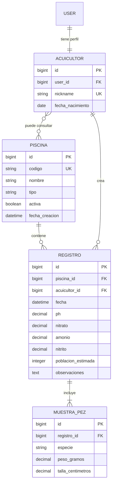
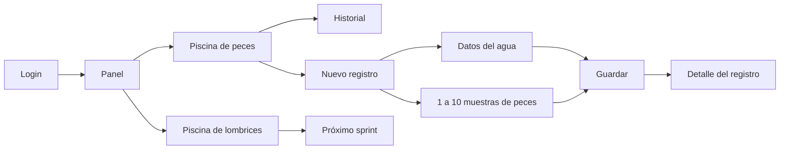

# Arquitectura de PaiPayTech

## Modelo de datos corregido

## Decisiones

1. `User` de Django administra usuario, contraseña, correo, sesiones y permisos. `Acuicultor` amplía ese usuario con datos del dominio.
2. La relación entre `Acuicultor` y `Piscina` permanece muchos-a-muchos. En este MVP las señales asignan cada piscina activa a todos los acuicultores.
3. `Registro` representa una medición ambiental realizada en una piscina en una fecha concreta.
4. `MuestraPez` es uno-a-muchos respecto de `Registro`, porque una medición puede tomar varias muestras de peces.
5. La piscina de lombrices existe como `tipo='lombrices'`, pero su modelo de muestra no se inventa hasta conocer variables reales del negocio.

## Flujo principal

