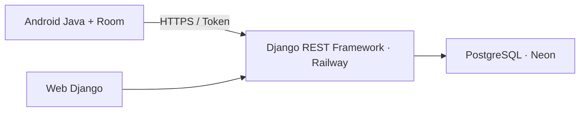
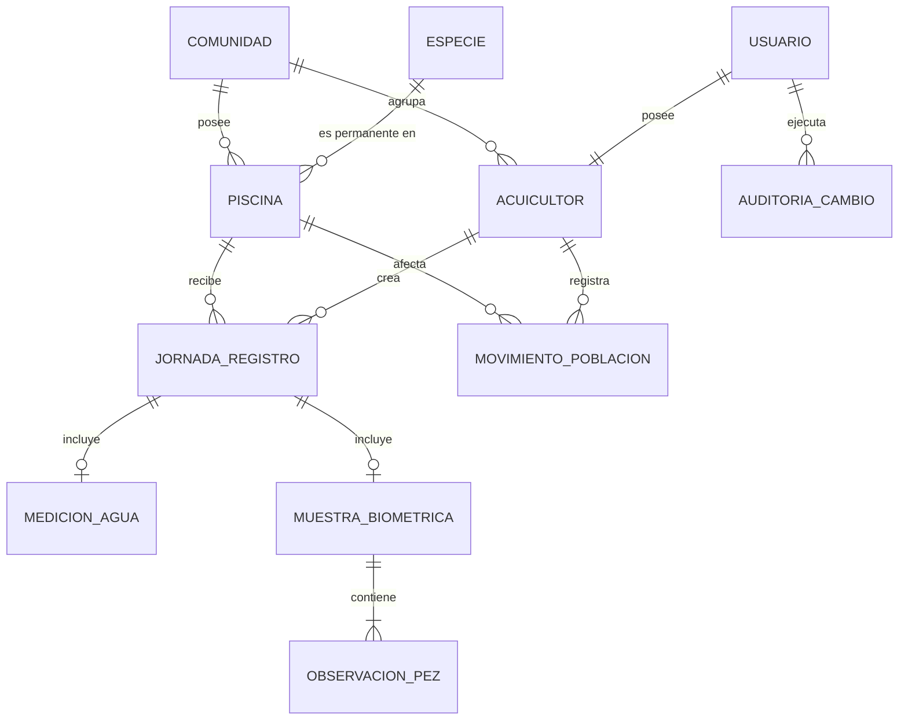

# Arquitectura de PaiPayTech v1.4

Django concentra autenticación, permisos, validación, auditoría y semáforo. Android nunca accede directamente a Neon y usa Room como fuente local para trabajar sin conexión.

## Límites de lectura

- Web: todos los miembros autenticados ven las jornadas de su comunidad.
- Android: descarga el historial del usuario actual, no el historial comunitario completo.
- Semáforo Android: descarga la última jornada comunitaria con agua de cada piscina.

## Sincronización

Android genera el UUID y guarda primero en Room. Solo una jornada local completa entra en la cola. `POST` es idempotente; `PUT` y anulación requieren la versión conocida. Un servidor adelantado devuelve `409`, y el dato local permanece pendiente hasta resolver el conflicto.

Los borradores solo existen localmente. En el servidor no hay borrado físico de jornadas ni movimientos: las anulaciones incrementan versión y crean auditoría.
