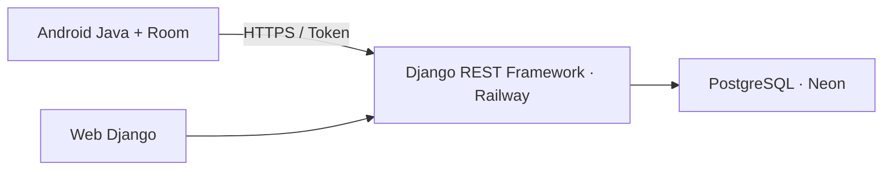
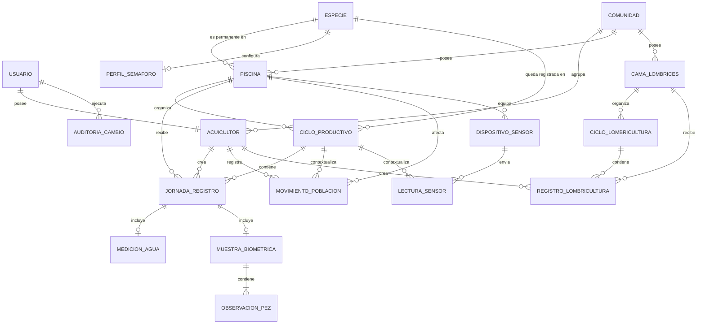

# Arquitectura de PaiPayTech v1.6-dev

Django concentra autenticación, permisos, validación, auditoría y semáforo. Android nunca accede directamente a Neon y usa Room como fuente local para trabajar sin conexión.

## Límites de lectura

- Web ordinaria y API móvil: cada cuenta ve únicamente piscinas, camas, usuarios
  y registros de su comunidad. Una URL directa hacia otro tenant da `404`.
- Web técnica: el superusuario dispone de `Todas las comunidades` o de un filtro
  por UUID público. Puede abrir instalaciones y registros transversalmente, pero
  el alcance global y una comunidad distinta de la de su perfil son de solo
  lectura; los registros operativos se firman con una cuenta del tenant real.
- Django Admin: el administrador funcional sigue limitado a su comunidad; solo
  el superusuario técnico puede consultar transversalmente.
- Android: cachea el historial comunitario para consulta offline; solo habilita
  edición/anulación para la cuenta autora.
- Semáforo Android: descarga la última jornada comunitaria con agua de cada piscina.

## Sincronización

Android genera UUID y guarda primero en Room. Sincroniza ciclos de piscinas y
camas antes de sus registros para que las referencias existan. `POST` es
idempotente; cierres, `PUT` y anulaciones requieren la versión conocida. Un
servidor adelantado devuelve `409`, y el dato local permanece en conflicto hasta
comparar y resolver.

La sesión Android conserva cifrado el UUID público de comunidad. Al iniciar con
otra cuenta o tenant, bloquea el cambio si existen pendientes/conflictos. Sin
pendientes, vacía Room antes de descargar el catálogo nuevo; por eso los UUID y
códigos locales nunca se mezclan entre comunidades.

El ciclo delimita desde la siembra hasta el destino final de toda la cohorte.
Una piscina solo tiene un ciclo activo y su especie es permanente. La población
inicial vive en la apertura; mortalidad, escape, traslado, venta parcial y ajuste
son movimientos excepcionales ligados a los ciclos afectados.

Agua y biometría siguen siendo bloques de una jornada: agua se espera semanal y
biometría mensual. Los recordatorios son estados derivados, no bloqueos.

Las camas son un agregado distinto: ciclo de lombricultura y registros con pH
del suelo/conteo. No reutilizan piscina, jornada, biometría ni movimientos.

La telemetría futura también atraviesa HTTPS y Django. Un sensor nunca conoce
`DATABASE_URL` ni accede a Neon. El endpoint permanece deshabilitado hasta
definir hardware, aprovisionamiento y rotación de credenciales.

Los borradores solo existen localmente. En el servidor no hay borrado físico de jornadas ni movimientos: las anulaciones incrementan versión y crean auditoría.
